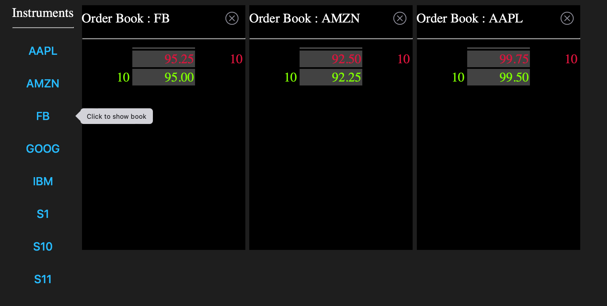

# go-trader

A financial exchange written in Go including complete order book, fix protocol, and market data distribution.

Check out [cpp_orderbook](https://github.com/robaho/cpp_orderbook) for a basic C++ version.

Uses quickfixgo or gRPC for client/server communication. 

Uses UDP multicast for market distribution.

It uses the high-performance fixed point library [fixed](https://github.com/robaho/fixed) which I also developed.

There is a sample client with a command line GUI, a sample "market maker", and a sample "playback".

The exchange itself has a bare bones web interface, that uses web sockets to provide real-time book updates.

The exchange is designed to allow for easy back-testing of trading strategies. It supports limit and market orders.

There is a very simple sample "algo". The program structure is applicable to many strategies that use an entry and exit price.
This can be run in conjunction with the 'marketmaker' sample to test the "algo". Hint: it has a 50/50 chance of being successful EXCEPT the
market maker bid/ask spread must be accounted for - which makes it far less than a 50/50 chance of being profitable...

There are two different web interfaces available:
- the default interface at / uses Go templates and server side rendering
- the alternative UI is written with Lit, and is available at /lit

Use `npm run build` in the web_lit directory to build the Lit assets.

It was primarily developed to further my knowledge of Go and test its suitability for high-performance financial applications.

# install

go get github.com/robaho/go-trader

# build

go install github.com/robaho/go-trader/cmd/exchange

go install github.com/robaho/go-trader/cmd/client

go install github.com/robaho/go-trader/cmd/marketmaker

go install github.com/robaho/go-trader/cmd/playback

# run

cd $GOPATH/src/github.com/robaho/go-trader/cmd

exchange &

marketmaker -symbol IBM

client

# performance

Configuration:

- client machine is a Mac Mini M1, running OSX Sonoma
- server machine is a 4.0 ghz i7 iMac (4 core, 8 thread), running OSX Monterey
- using 1 gbit ethernet connection
- a quote is a double-sided (bid & ask) 
- timings are measured from the quote message generation on the client, to the reception of the multicast market data on the client

**using `marketmaker -bench 75 -proto fix`**

90k+ round-trip quotes per second with an average latency of 1ms

```
updates per second 72707, max ups 72707,  avg rtt 832us, 10% rtt 595us 99% rtt 5365us
updates per second 90279, max ups 90279,  avg rtt 830us, 10% rtt 0us 99% rtt 4515us
updates per second 89215, max ups 90279,  avg rtt 840us, 10% rtt 0us 99% rtt 4851us
```

**using `marketmaker -bench 250 -proto grpc`**

**400k+** round-trip quotes per second with an average latency of 600us

```
updates per second 410094, max ups 414584,  avg rtt 609us, 10% rtt 0us 99% rtt 2390us
updates per second 411559, max ups 414584,  avg rtt 607us, 10% rtt 0us 99% rtt 2455us
updates per second 412884, max ups 414584,  avg rtt 605us, 10% rtt 0us 99% rtt 2270us
```

_The CPUs are saturated on both the client and server._

## less than 3 microseconds per roundtrip quote over the network ! ##
<br>

# REST api

access full book (use guest/password to login)

localhost:8080/api/book/SYMBOL

localhost:8080/api/stats/SYMBOL

# screen shots



