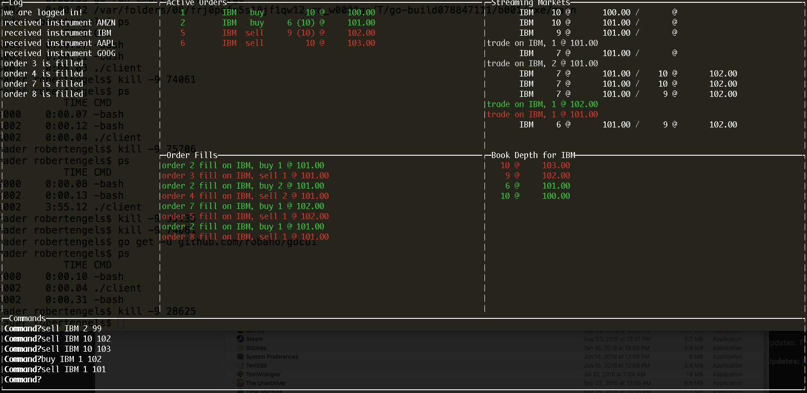
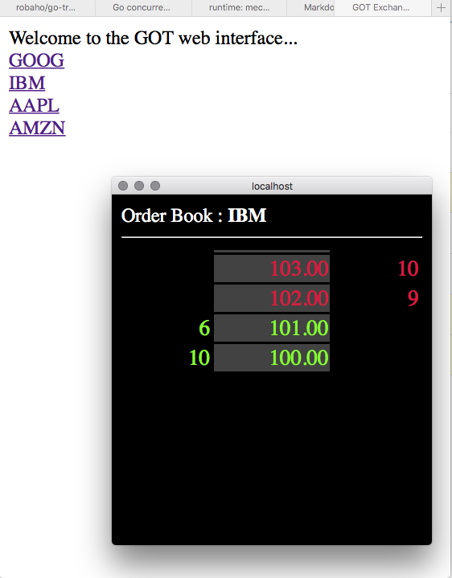

# go-trader

A financial exchange written in Go. Uses quickfixgo or gRPC for client/server communication. Uses UDP multicast for market distribution.

There is a sample client with a command line GUI, a sample "market maker", and a sample "playback".

The exchange itself has a bare bones web interface, that uses web sockets to provide real-time book updates.

The exchange is designed to allow for easy back-testing of trading strategies. It supports limit and market orders.

There is a very simple sample "algo". The program structure is applicable to many strategies that use an entry and exit price.
This can be run in conjunction with the 'marketmaker' sample to test the "algo". Hint: it has a 50/50 chance of being successful EXCEPT the
market maker bid/ask spread must be accounted for - which makes it far less than a 50/50 chance of being profitable...  

It was primarily developed to further my knowledge of Go and test its suitability for high-performance financial applications.

# install

go get github.com/robaho/go-trader

# build

go install github.com/robaho/go-trader/cmd/exchange

go install github.com/robaho/go-trader/cmd/client

go install github.com/robaho/go-trader/cmd/marketmaker

go install github.com/robaho/go-trader/cmd/playback

# run

cd $GOPATH/src/github.com/robaho/go-trader/cmd

exchange &

marketmaker -symbol IBM

client

# performance

Using the quickfixgo connector:

- test machine is a 3.4 ghz i7 (4 core,8 thread), running osx
- clients and exchange process are running on the same machine
- a quote is a double-sided (bid & ask) 
- a timing is measured from the quote message generation to the reception of the multicast market data

**1 market maker can perform 6k round-trip quotes/sec**

**4 market makers can perform 16k round-trip quotes/sec** 

Using the gRPC connector:

**1 market maker can perform 10k round-trip quotes/sec**

**4 market makers can perform 25k round-trip quotes/sec** 

Using branch 'fixed', which use the high-performance fixed point library [fixed](https://github.com/robaho/fixed), and gRPC:

**1 market maker can perform 12k round-trip quotes/sec**

**4 market makers can perform 30k round-trip quotes/sec** 

# REST api

access full book (use guest/password to login)

localhost:8080/api/book/SYMBOL

localhost:8080/api/stats/SYMBOL

# screen shots

